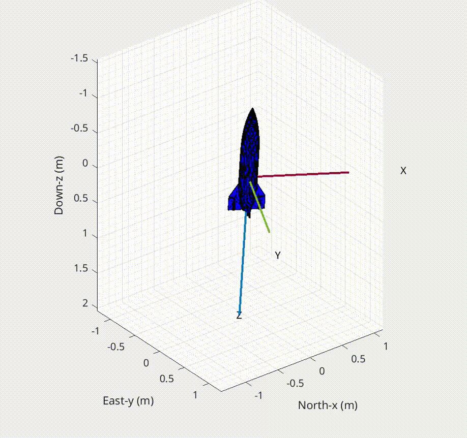
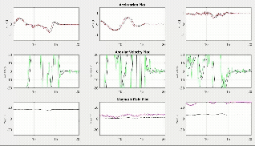
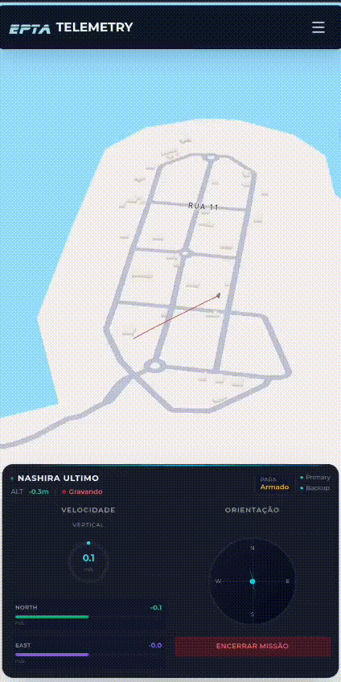

# Payload Telemetry System

Rocket payload telemetry system developed for the **LASC 2025 NASHIRA** mission (Latin American Space Challenge).

## Demo

### Rocket Attitude Visualization
Real-time 3D rocket orientation using quaternion-based sensor fusion.



### IMU Data Acquisition
Raw and filtered IMU readings with real-time visualization.



### System Testing
Integration testing of the complete telemetry system.



## Features

- **Extended Kalman Filter (EKF)** for 3D position estimation fusing GPS, barometer, and IMU data
- **Flight State Machine** with automatic phase detection:
  - `IDLE` → `ARMED` → `BOOST` → `COAST` → `APOGEE` → `DROGUE_DESCENT` → `MAIN_DESCENT` → `LANDED`
- **Quaternion-based attitude estimation** with multiple filter options:
  - Complementary filter
  - Kalman filter
  - Madgwick filter
- **Adaptive sensor fusion** that adjusts filtering based on flight phase
- **SD card data logging** with FatFS (CSV format with full telemetry)
- **LoRa telemetry transmission** via E22-900T22D module
- **Multi-constellation GNSS** support with flight mode configuration

## Hardware

| Component | Model | Interface |
|-----------|-------|-----------|
| MCU | STM32G431CBT6 | - |
| IMU | ICM-20948 | SPI |
| Barometer | ICP-10100 | I2C |
| GNSS | Multi-constellation | UART |
| Radio | E22-900T22D (LoRa) | UART |
| Storage | SD Card | SPI (FatFS) |
| Ground Station | ESP32 | - |

## Repository Structure

```
├── Payload_LASC2025_STM32G431CBT6/   # Main STM32 firmware
│   ├── Core/Inc/                      # Header files
│   │   ├── ROCKET.h                   # System management & EKF
│   │   ├── ROCKET_FSM.h               # Flight state machine
│   │   ├── IMU_FUSION.h               # Sensor fusion algorithms
│   │   ├── IMU.h                      # ICM-20948 driver
│   │   ├── BAR.h                      # ICP-10100 barometer driver
│   │   ├── GNSS.h                     # GNSS module driver
│   │   ├── LORA.h                     # E22-900T22D LoRa driver
│   │   └── SD.h                       # SD card interface
│   └── Core/Src/                      # Source files
├── Base_Receptor/                     # ESP32 ground station receiver
│   └── Base_Receptor.ino              # Arduino sketch for telemetry reception
├── Matlab Simulations/                # Analysis & visualization tools
│   ├── NASHIRA_MISSION_V6.m           # Flight data processing
│   ├── IMUDataViewer_Attitude.m       # Real-time attitude visualization
│   ├── IMUDataViewer_Orientation_and_Position.m
│   ├── mag_cal.m                      # Magnetometer calibration
│   └── ...
└── media/                             # Demo GIFs
```

## Sensor Fusion & Algorithms

### Extended Kalman Filter (EKF)
The EKF fuses data from multiple sensors for accurate 3D position and velocity estimation:
- **State vector**: `[x, y, z, vx, vy, vz]` in NED frame
- **Prediction**: Uses IMU accelerations (gravity-compensated)
- **Update**: GPS position and barometer altitude measurements
- Automatic symmetry enforcement to prevent numerical divergence

### Attitude Estimation
Multiple filter implementations for robust attitude estimation:
- **Complementary Filter**: Fast, low computational cost
- **Kalman Filter**: Per-axis filtering with bias estimation
- **Madgwick Filter**: Quaternion-based AHRS with magnetometer fusion

### Adaptive Filtering
The system automatically adjusts sensor fusion parameters based on flight phase:
- High-G detection during boost phase
- Gyro-only integration during motor burn
- Recovery algorithms post-boost for attitude reconvergence

## Flight State Machine

The FSM automatically detects flight phases using sensor data:

| State | Detection Criteria |
|-------|-------------------|
| IDLE | System powered, waiting |
| ARMED | RBF removed |
| BOOST | Acceleration > 2g threshold |
| COAST | Motor burnout detected (acc drop) |
| APOGEE | Velocity < threshold, altitude drop |
| DROGUE_DESCENT | Post-apogee descent |
| MAIN_DESCENT | Main parachute altitude |
| LANDED | Low velocity + acceleration for 3s |

## MATLAB Analysis Tools

| Script | Description |
|--------|-------------|
| `NASHIRA_MISSION_V6.m` | Complete flight data processing and analysis |
| `IMUDataViewer_Attitude.m` | Real-time 3D attitude visualization |
| `IMUDataViewer_Orientation_and_Position.m` | Combined orientation and position display |
| `mag_cal.m` / `GetMagCal.m` | Magnetometer calibration (hard/soft iron) |
| `KalmanPedro.m` | Kalman filter implementation reference |

## Building

### STM32 Firmware
1. Open `Payload_LASC2025_STM32G431CBT6/` in STM32CubeIDE
2. Build the project
3. Flash to STM32G431CBT6 via ST-Link

### Ground Station
1. Open `Base_Receptor/Base_Receptor.ino` in Arduino IDE
2. Select ESP32 board
3. Upload to ESP32

## Mission Context

- **Event**: LASC 2025 (Latin American Space Challenge)
- **Rocket**: NASHIRA
- **Payload**: Telemetry and data acquisition system

## License

See [LICENSE](LICENSE) file.
